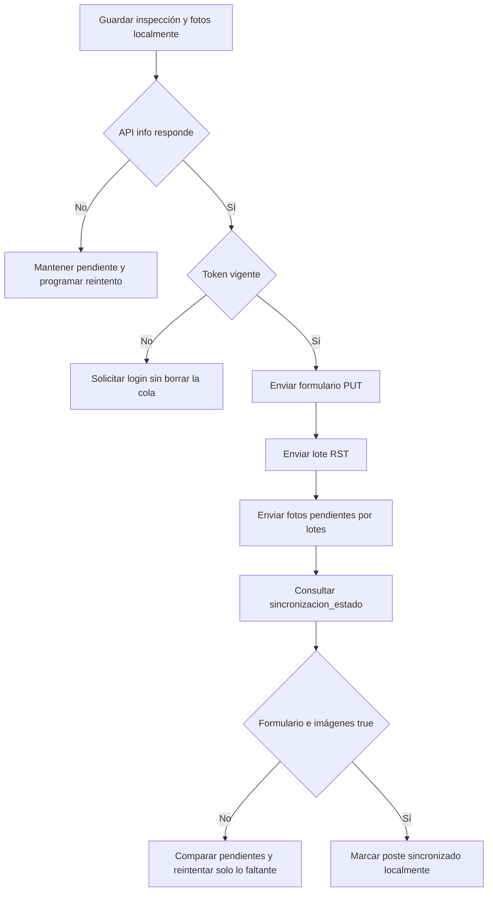

# Conexión y sincronización del cliente móvil con ECOING

Este documento es el contrato de integración para el cliente móvil. Describe la configuración de red, autenticación, consulta del padrón, captura offline y sincronización de formularios, secciones RST e imágenes con el backend PHP que corre en XAMPP.

## 1. Datos esenciales

| Concepto | Valor |
|---|---|
| Carpeta local del sistema | `C:\xampp82\htdocs\INSPEECIONLIGERAECOING` |
| API desde la misma PC | `http://localhost/INSPEECIONLIGERAECOING/api` |
| API desde Android Emulator | `http://10.0.2.2/INSPEECIONLIGERAECOING/api` |
| API desde el teléfono en el Wi-Fi actual | `http://192.168.18.28/INSPEECIONLIGERAECOING/api` |
| Alternativa por la interfaz Ethernet actual | `http://192.168.18.21/INSPEECIONLIGERAECOING/api` |
| Salud del servicio | `GET {API_BASE_URL}/info.php` |
| Formato de datos | JSON UTF-8; imágenes mediante `multipart/form-data` |
| Autenticación | JWT en `Authorization: Bearer <token>` |
| Zona horaria del servidor | `America/Lima` |

La IP puede cambiar cuando se reinicia el router. La app no debe repetir la URL en varios archivos: debe existir un solo valor `API_BASE_URL`, configurable por ambiente o desde una pantalla protegida de configuración.

`localhost` dentro de un teléfono o emulador se refiere al propio dispositivo, no a la PC donde está XAMPP.

### Configuración recomendada en Flutter

```dart
abstract final class ApiConfig {
  static const baseUrl = String.fromEnvironment(
    'API_BASE_URL',
    defaultValue: 'http://10.0.2.2/INSPEECIONLIGERAECOING/api',
  );
}
```

Ejemplos de compilación:

```text
Emulador: --dart-define=API_BASE_URL=http://10.0.2.2/INSPEECIONLIGERAECOING/api
Teléfono: --dart-define=API_BASE_URL=http://192.168.18.28/INSPEECIONLIGERAECOING/api
```

No concatenar barras a ciegas. Normalizar la base sin `/` final y construir cada ruta como `${baseUrl}/usuarios/login.php`.

## 2. Preparación de XAMPP y la red

1. Iniciar **Apache** y **MySQL** en XAMPP.
2. Comprobar en la PC: `http://localhost/INSPEECIONLIGERAECOING/api/info.php`.
3. Conectar PC y teléfono a la misma red local.
4. Comprobar desde el navegador del teléfono: `http://192.168.18.28/INSPEECIONLIGERAECOING/api/info.php`.
5. La respuesta correcta es:

```json
{"success":true,"service":"ECOING API","status":"ok"}
```

Si no responde desde el teléfono:

- confirmar la IP vigente con `ipconfig` en la PC;
- comprobar que la red de Windows esté marcada como **Privada**;
- permitir Apache HTTP Server o el puerto TCP 80 en el Firewall de Windows para redes privadas;
- desactivar el aislamiento entre clientes del punto de acceso, si el router lo utiliza;
- no abrir el puerto 80 hacia Internet ni configurar port forwarding.

Para HTTP local en Android se requieren el permiso de Internet y, durante desarrollo, tráfico sin TLS:

```xml
<uses-permission android:name="android.permission.INTERNET" />

<application
    android:usesCleartextTraffic="true"
    ... />
```

`usesCleartextTraffic` es aceptable solo en una red local de pruebas. Para publicar o conectar por Internet se debe usar HTTPS y eliminar esa excepción.

Las aplicaciones Android/iOS nativas no aplican CORS. Si el cliente fuese Flutter Web o una PWA, su origen exacto deberá agregarse a `CORS_ALLOWED_ORIGINS` en `.env`.

## 3. Primera puesta en marcha

El SQL local ya carga el proyecto y las 1,235 estructuras, pero no crea usuarios.

1. Desde la PC abrir `http://localhost/INSPEECIONLIGERAECOING/web/`.
2. Usar **Configurar el primer administrador**.
3. Crear desde ese administrador las cuentas de técnicos o supervisores.
4. El móvil únicamente debe iniciar sesión. No debe intentar crear el primer administrador, porque esa operación está restringida a `127.0.0.1`/`::1`.

El padrón inicial contiene este control de cantidades:

| Línea | Estructuras | Con UTM base |
|---|---:|---:|
| `L-6021` | 341 | 0 |
| `L-6024` | 118 | 0 |
| `L-6025` | 138 | 0 |
| `L-6026` | 107 | 0 |
| `L-6027-1` | 289 | 0 |
| `L-6027-2` | 206 | 206 |
| `L-6311` | 36 | 36 |
| **Total** | **1,235** | **242** |

La app debe obtener el proyecto y sus IDs mediante el API. No debe asumir permanentemente que el proyecto es `2`, aunque ese sea el ID de la carga inicial actual.

## 4. Convenciones HTTP

Para JSON enviar siempre:

```http
Accept: application/json
Content-Type: application/json; charset=utf-8
Authorization: Bearer <token>
```

El login y `info.php` no usan token. Todos los demás endpoints de consulta y captura sí lo requieren.

Una respuesta JSON exitosa contiene `"success": true`. Un error normalmente contiene:

```json
{
  "success": false,
  "error": "Descripción legible del problema."
}
```

No considerar exitoso un envío solo por recibir HTTP 200: también se debe validar `success`. En la carga de imágenes se debe revisar además cada elemento de `resultados` porque una petición puede procesar algunas imágenes y rechazar otras.

### Códigos que debe manejar el móvil

| HTTP | Acción del móvil |
|---:|---|
| `200`, `201` | Validar `success`; guardar el acuse del servidor. |
| `400` | JSON inválido. Corregir el serializador; no reintentar automáticamente. |
| `401` | Token ausente o expirado. Pausar la cola y pedir nuevo login. |
| `403` | Usuario sin permisos. No reintentar automáticamente. |
| `404` | Proyecto/poste inexistente o búsqueda vacía. Refrescar el padrón. |
| `409` | Duplicado o estado incompatible. Mostrar conflicto. |
| `413` | Lote de imágenes demasiado grande. Comprimir o dividir el lote. |
| `422` | Datos incompletos/no permitidos. Marcar el trabajo con error corregible. |
| `429` | Demasiados intentos. Esperar antes de volver a intentar. |
| `500`, `503`, timeout | Mantener datos locales y reintentar con espera incremental. |

Tiempos de espera sugeridos: 10 segundos para salud, 30 segundos para JSON, 120 segundos para lotes de imágenes y hasta 1,500 segundos para el ZIP masivo de PDFs.

## 5. Autenticación

### Iniciar sesión

`POST /usuarios/login.php`

```json
{
  "nombre_usuario": "tecnico01",
  "contrasena": "contraseña-del-usuario"
}
```

Respuesta relevante:

```json
{
  "success": true,
  "token": "eyJ...",
  "token_ttl": 604800,
  "usuario": {
    "id": 2,
    "nombre_usuario": "tecnico01",
    "nombre_completo": "Técnico de campo",
    "correo_electronico": "tecnico@example.com",
    "rol": "tecnico",
    "dispositivo_id": null
  }
}
```

- Guardar el token únicamente en almacenamiento seguro del sistema operativo.
- No guardar contraseñas, no imprimir el token en logs y nunca enviarlo en la URL.
- El token dura actualmente 604,800 segundos (7 días).
- No existe refresh token. Ante un `401`, detener los envíos, conservar la cola y solicitar login nuevamente.
- Cinco intentos erróneos pueden bloquear temporalmente el login durante 15 minutos.

Roles disponibles: `administrador`, `supervisor`, `tecnico`, `invitado`. El invitado puede consultar, pero no enviar inspecciones.

## 6. Descarga del padrón y búsqueda

Al iniciar sesión o al solicitar **Actualizar padrón**:

1. `GET /proyectos/listar.php?estado=activo`
2. Para cada proyecto seleccionado: `GET /postes/listar.php?proyecto_id={id}`
3. Guardar proyectos y postes en la base local del móvil mediante upsert por ID.
4. No borrar inspecciones locales pendientes cuando se refresca el padrón.

Rutas principales:

| Método y ruta | Uso |
|---|---|
| `GET /proyectos/listar.php?estado=activo` | Proyectos disponibles. Admite `busqueda`. |
| `GET /proyectos/obtener.php?id={id}` | Detalle de un proyecto. |
| `GET /proyectos/contar_estado.php` | Totales por estado. |
| `GET /postes/listar.php?proyecto_id={id}` | Padrón completo del proyecto. |
| `GET /postes/listar.php?proyecto_id={id}&inspeccionado=false` | Solo pendientes según el servidor. |
| `GET /postes/buscar_por_linea.php?linea={linea}&proyecto_id={id}` | Estructuras de una línea. |
| `GET /postes/buscar_estructura.php?estructura={nro}&linea={linea}&proyecto_id={id}` | Búsqueda exacta de estructura. |
| `GET /postes/obtener.php?id={poste_id}` | Poste, formulario y RST. |
| `GET /postes/poste_datos.php?poste_id={id}` | Poste, formulario, RST e imágenes registradas. |
| `GET /postes/sincronizacion_estado.php?poste_id={id}` | Confirmación final de formulario e imágenes. |

Siempre aplicar URL encoding a `linea`, `estructura` y búsquedas. La pantalla de búsqueda debe trabajar primero contra el caché local para funcionar sin señal y consultar el servidor solo al refrescar.

Los campos `id` y `proyecto_id` pueden llegar como números; los `DECIMAL`, como UTM, pueden llegar como texto según el cliente MySQL. El parser móvil debe aceptar ambos y convertir de forma segura. Los indicadores `0/1` deben normalizarse a booleanos.

## 7. Captura local antes de sincronizar

La inspección debe guardarse en el dispositivo antes de intentar cualquier petición. Como mínimo conservar:

- `poste_id`, `proyecto_id`, `codigo`, `linea` y `estructura`;
- formulario completo en JSON;
- registros RST;
- una fila por foto con tipo, ruta local inmutable, fecha, UTM, zona y checksum opcional;
- estado de envío y acuse por formulario, RST y por cada tipo de foto;
- número de intentos, próximo intento y último error.

Modelo sugerido para la cola:

```text
sync_jobs(
  id_uuid, poste_id, tipo, clave_item, payload_json, ruta_archivo,
  estado, intentos, proximo_intento, ultimo_error, creado_en, actualizado_en
)

estado = PENDIENTE | ENVIANDO | CONFIRMADO | ERROR_CORREGIBLE
tipo   = FORMULARIO | RST | FOTO
```

Nunca eliminar una foto local al recibir solamente HTTP 200. Eliminarla o archivarla únicamente cuando ese tipo figure confirmado en la respuesta y la verificación final del poste sea satisfactoria.

Evitar dos workers sobre el mismo poste. Procesar un solo flujo de sincronización por poste y limitar la concurrencia global, por ejemplo, a dos postes.

## 8. Envío del formulario

`PUT /postes/actualiza-datos.php?poste_id={id}`

`distancia_acceso` es obligatoria y debe ser mayor o igual a cero. El resto de campos puede enviarse cuando corresponda.

```json
{
  "fecha_inspeccion": "2026-08-18 11:15:00",
  "distancia_acceso": 12.5,
  "cantidad_pat": 1,
  "obstaculos_faja": ["arboles", "cercos_vallas"],
  "estado_cuencas": "n_a",
  "marcado_arboles": "no",
  "criticidad_tala": "bajo",
  "criticidad_contacto": "seguimiento",
  "notificacion_propietario": "persona_natural",
  "tipo_torre": "alineamiento",
  "ubicacion": "rural_con_vegetacion",
  "acceso_torre": "a_pie",
  "estado_acceso": "bueno",
  "estado_placas_torre": "bueno",
  "estado_placas_linea": "bueno",
  "estado_placas_fases": "bueno",
  "peligro_cerco": "no_existe",
  "peligro_torre": "bueno",
  "puesta_tierra": "bueno",
  "retenida": "n_a",
  "estado_base": "buen_estado",
  "limpiar_base": "no",
  "crucetas_mensuales": "buen_estado",
  "perfiles_angulares": "buen_estado",
  "malla_antiescalamiento": "buen_estado",
  "oxidos_base": "no",
  "cadena_aisladores": "en_suspension",
  "tipo_aislador": "vidrio",
  "conductor_bajada_pat": "buen_estado",
  "conductor_guarda": "n_a",
  "comentarios": "Sin observaciones adicionales."
}
```

Fecha recomendada: `YYYY-MM-DD HH:mm:ss`, correspondiente a la hora local de Lima. Los comentarios se limitan a 5,000 caracteres.

El envío es idempotente: repetirlo para el mismo `poste_id` actualiza la misma fila, no crea otro formulario.

### Valores permitidos del formulario

| Campo | Valores exactos |
|---|---|
| `obstaculos_faja` | Lista: `invasiones_nuevas`, `construcciones_nuevas`, `proceso_construccion`, `cercos_vallas`, `arboles`, `arbustos`, `arboles_fuera_faja`, `otros`, `n_a` |
| `estado_cuencas` | `seguimiento`, `critico`, `n_a` |
| `marcado_arboles` | `si`, `no` |
| `criticidad_tala` | `bajo`, `seguimiento`, `critico`, `n_a` |
| `criticidad_contacto` | `bajo`, `seguimiento`, `critico`, `n_a` |
| `notificacion_propietario` | `persona_natural`, `persona_juridica`, `otro` |
| `tipo_torre` | `alineamiento`, `angulo`, `fin_linea` |
| `ubicacion` | `rural_con_vegetacion`, `urbana`, `industrial`, `rural_sin_vegetacion`, `zona_sujeta_huaycos`, `desertico` |
| `acceso_torre` | `a_pie`, `en_vehiculo` |
| `estado_acceso` | `bueno`, `mal_estado` |
| `estado_placas_torre` | `bueno`, `malo`, `no_existe` |
| `estado_placas_linea` | `bueno`, `malo`, `no_existe` |
| `estado_placas_fases` | `bueno`, `malo`, `no_existe` |
| `peligro_cerco` | `bueno`, `malo`, `no_existe` |
| `peligro_torre` | `bueno`, `malo`, `no_existe` |
| `puesta_tierra` | `bueno`, `malo`, `no_existe` |
| `retenida` | `buen_estado`, `cambiar_preforme`, `retemplar`, `n_a` |
| `estado_base` | `buen_estado`, `mal_estado` |
| `limpiar_base` | `si`, `no` |
| `crucetas_mensuales` | `buen_estado`, `mal_estado`, `falta_ajustar`, `n_a` |
| `perfiles_angulares` | `buen_estado`, `mal_estado`, `falta`, `n_a` |
| `malla_antiescalamiento` | `buen_estado`, `mal_estado`, `falta`, `n_a` |
| `oxidos_base` | `si`, `no`, `n_a` |
| `cadena_aisladores` | `en_suspension`, `en_anclaje`, `en_cuello_muerto` |
| `tipo_aislador` | `vidrio`, `porcelana`, `polimero` |
| `conductor_bajada_pat` | `buen_estado`, `conductor_en_mal_estado`, `grapas_en_mal_estado`, `listones_en_mal_estado`, `n_a` |
| `conductor_guarda` | `hebras_rotas`, `encanastillado`, `empalme_deformado`, `objetos_extranos`, `n_a` |

No enviar etiquetas visibles como “Buen estado”. Enviar exactamente el código `buen_estado`.

## 9. Envío de secciones RST

`POST /postes/agregar-seccion-rst.php?poste_id={id}`

```json
{
  "registros": [
    {"seccion":"conductores_fase","fase":"R","atributo":"hebras_rotas"},
    {"seccion":"conductores_fase","fase":"S","atributo":"encanastillado"},
    {"seccion":"estado_aisladores","fase":"T","atributo":"buen_estado"}
  ]
}
```

Secciones permitidas:

- `conductores_fase`
- `conductores_cuellos`
- `conductores_guarda`
- `estado_aisladores`

Fases permitidas: `R`, `S`, `T`.

Para las tres secciones de conductores: `hebras_rotas`, `encanastillado`, `empalme_deformado`, `objetos_extranos`.

Para `estado_aisladores`: `buen_estado`, `rotos_suspension`, `rotos_anclaje_adelante`, `rotos_anclaje_atras`, `mal_estado`.

La combinación `poste_id + seccion + fase` es única. Repetir el envío reemplaza el atributo anterior y por ello es seguro reintentarlo. El estado RST no forma parte de `sincronizacion_estado.php`; el móvil debe conservar el acuse `success=true` de este endpoint.

## 10. Envío de imágenes

`POST /postes/imagenes-poste.php?poste_id={id}` usando `multipart/form-data`.

Por cada índice `N`, enviar las claves con el mismo número:

| Clave | Contenido |
|---|---|
| `imagen_N` | Archivo JPEG o PNG. |
| `nombre_foto_N` | Uno de los 28 códigos permitidos. |
| `fecha_captura_N` | `YYYY-MM-DD HH:mm:ss`. |
| `utm_este_N` | Número decimal opcional. |
| `utm_norte_N` | Número decimal opcional. |
| `zona_N` | Zona UTM opcional, por ejemplo `19S`. |

Ejemplo conceptual:

```text
imagen_0        = archivo panoramica.jpg
nombre_foto_0   = foto_panoramica
fecha_captura_0 = 2026-08-18 11:20:00
utm_este_0      = 379940.00
utm_norte_0     = 8285132.00
zona_0          = 19S

imagen_1        = archivo placa.jpg
nombre_foto_1   = placa
...
```

No establecer manualmente el `Content-Type` multipart en el móvil: la librería HTTP debe generar el `boundary`.

### Los 28 tipos exactos

1. `foto_panoramica`
2. `placa`
3. `torre_parte_inferior`
4. `torre_parte_superior`
5. `base_torre`
6. `mensulas`
7. `crucetas`
8. `perfiles_angulares`
9. `atiescalamiento`
10. `otros`
11. `aisladores_fase_r_atras`
12. `aisladores_fase_s_atras`
13. `aisladores_fase_t_atras`
14. `aisladores_fase_r_adelante`
15. `aisladores_fase_s_adelante`
16. `aisladores_fase_t_adelante`
17. `ferreteria_fase_r`
18. `ferreteria_fase_s`
19. `ferreteria_fase_t`
20. `cable_guarda`
21. `ferreteria_de_cable_de_guarda`
22. `conductor`
23. `ferreteria_de_conductor`
24. `puesta_tierra`
25. `puesta_tierra_2`
26. `retenida`
27. `faja_servidumbre`
28. `ubicacion_acceso`

El backend considera las imágenes completas solamente cuando existen los 28 tipos distintos, incluido `otros`. Solo puede quedar una imagen vigente por poste y tipo; una recaptura reemplaza el archivo anterior.

Restricciones del servidor:

- JPEG o PNG real, validado por contenido;
- máximo 10 MB por imagen;
- máximo 100 MB por petición;
- máximo 40 millones de píxeles en la imagen de entrada;
- hasta 30 archivos por petición;
- el servidor corrige orientación EXIF, limita el lado mayor a 2,400 px y almacena JPEG con calidad 85.

Aunque caben 28 archivos, se recomienda comprimir en el móvil y enviar lotes de 4 a 8 imágenes para tolerar cortes de red. Los índices empiezan nuevamente en cero en cada lote. Cada tipo confirmado se retira individualmente de la cola; los tipos fallidos permanecen pendientes.

Respuesta relevante:

```json
{
  "success": true,
  "poste_id": 1200,
  "imagenes_procesadas": 6,
  "imagenes_almacenadas": 28,
  "imagenes_requeridas": 28,
  "imagenes_completas": true,
  "resultados": {
    "imagen_0": {"success": true, "nombre_foto": "foto_panoramica"}
  }
}
```

## 11. Flujo de sincronización recomendado



Reglas operativas:

1. Guardar todo localmente antes de enviar.
2. Verificar conectividad real con `info.php`; el indicador Wi-Fi por sí solo no basta.
3. Enviar primero formulario, luego RST y finalmente imágenes.
4. Reintentar únicamente operaciones pendientes. Los tres endpoints de captura usan upsert y toleran reenvíos.
5. Al terminar consultar `GET /postes/sincronizacion_estado.php?poste_id={id}`.
6. El poste solo está completo en servidor cuando `formulario_subido=true` e `imagenes_subidas=true`.
7. Confirmar RST con el acuse guardado por el móvil, ya que el endpoint de estado no informa RST.
8. Opcionalmente consultar `poste_datos.php` y comparar cantidad/tipos de fotos antes de liberar archivos locales.

El campo general `sincronizado` del poste también se mantiene verdadero únicamente cuando formulario e imágenes están completos, pero el móvil debe usar los dos indicadores específicos para mostrar el progreso.

### Reintentos

Usar espera incremental con variación aleatoria, por ejemplo: 5 s, 15 s, 30 s, 1 min, 2 min y máximo 5 min. Reiniciar la espera cuando el usuario pulse **Sincronizar ahora** o regrese la conexión.

- Reintentar timeout, desconexión, `500` y `503`.
- Ante `401`, pausar todos los jobs hasta nuevo login.
- Ante `413`, dividir el lote o recomprimir; no repetir el mismo cuerpo.
- Ante `422`, guardar el mensaje y pedir corrección al usuario.
- No ejecutar reintentos infinitos en primer plano.

El servidor aplica “último envío válido gana”. Como no existe control de versión por inspección, se debe evitar que dos técnicos editen simultáneamente el mismo poste.

## 12. Informes disponibles

Estas rutas devuelven archivos binarios, no JSON cuando funcionan:

| Método y ruta | Respuesta |
|---|---|
| `GET /ver_pdf_poste.php?poste_id={id}&proyecto_id={id}` | `application/pdf` |
| `GET /exportar_excel_linea.php?proyecto_id={id}&linea={linea}` | Archivo `.xlsx` |
| `GET /exportar_linea_pdf.php?proyecto_id={id}&linea={linea}` | ZIP con PDFs |

Enviar igualmente el token Bearer. Guardar el cuerpo como bytes y obtener el nombre desde `Content-Disposition`. No intentar decodificar una respuesta exitosa como JSON.

## 13. Operaciones administrativas

El flujo habitual del técnico usa el padrón precargado y no debe crear estructuras nuevas. Las siguientes rutas quedan para pantallas administrativas:

| Ruta | Roles |
|---|---|
| `POST /usuarios/register.php` | administrador |
| `GET /usuarios/listar.php` | administrador |
| `POST /proyectos/crear.php` | administrador, supervisor |
| `PUT|PATCH /proyectos/actualizar.php` | administrador, supervisor |
| `POST|PATCH /proyectos/cambiar_estado.php` | administrador, supervisor |
| `DELETE /proyectos/eliminar.php` | administrador; cancela, no borra físicamente |
| `POST /postes/crear.php` | administrador, supervisor, tecnico |

`postes/crear.php` no acepta UTM y no debe usarse para duplicar el padrón existente. Un código repetido dentro del mismo proyecto devuelve `409`.

## 14. Pruebas de aceptación del móvil

Antes de declarar lista una versión móvil, verificar:

- [ ] `info.php` responde desde el dispositivo real, no solo desde la PC.
- [ ] La URL está centralizada y cambia entre emulador/teléfono sin editar múltiples archivos.
- [ ] El login guarda el token de forma segura y un `401` no borra la inspección local.
- [ ] Se descargan 1,235 estructuras y los totales por línea coinciden con este documento.
- [ ] La búsqueda funciona offline por línea, código y estructura.
- [ ] Cerrar la app durante una captura no pierde formulario, RST ni rutas de fotos.
- [ ] El formulario se puede reenviar sin duplicarse.
- [ ] RST se puede reenviar y actualiza la combinación sección/fase.
- [ ] Una foto reintentada reemplaza únicamente el mismo tipo.
- [ ] Un lote con fallo parcial conserva solo los tipos no confirmados.
- [ ] El móvil divide o comprime un lote que supera 100 MB.
- [ ] Con 27 fotos el estado permanece incompleto; con las 28 cambia a completo.
- [ ] La pantalla distingue: pendiente local, enviando, formulario confirmado, fotos parciales, completo y error corregible.
- [ ] Tras sincronizar, `sincronizacion_estado.php` devuelve ambos indicadores en `true`.
- [ ] Activar modo avión, capturar datos, cerrar/abrir la app y reconectar produce una sincronización correcta.
- [ ] No aparecen tokens, contraseñas, comentarios ni coordenadas en logs de depuración.

## 15. Criterio final de “sincronizado”

Una inspección puede mostrarse como **Sincronizada** únicamente si se cumplen todas estas condiciones:

```text
acuse_formulario == true
AND acuse_rst == true, cuando existan registros RST
AND 28 tipos de foto confirmados
AND servidor.formulario_subido == true
AND servidor.imagenes_subidas == true
```

Hasta entonces los archivos y datos locales deben conservarse. Esta regla evita falsos positivos, pérdida de fotos y postes que aparezcan completos cuando solo llegó una parte de la inspección.
